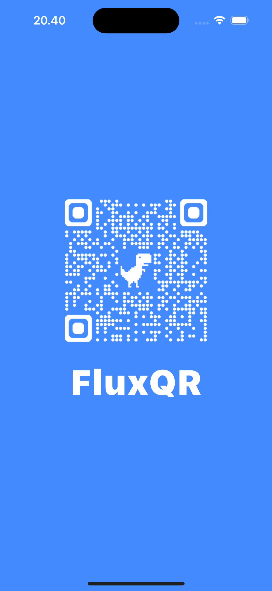
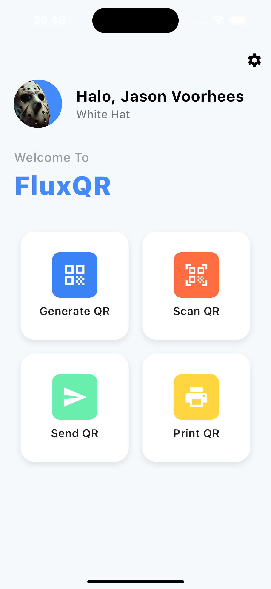
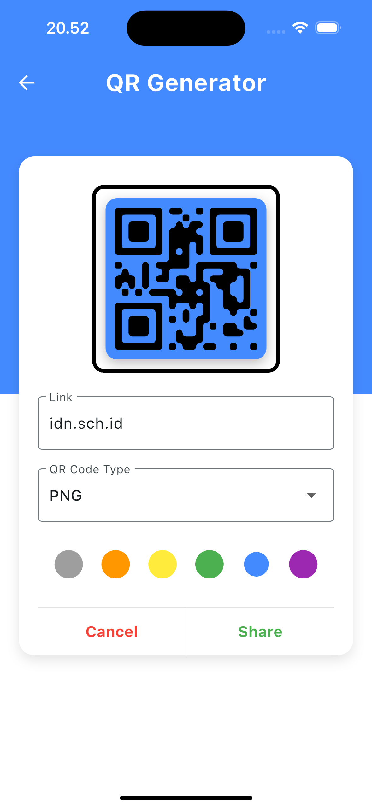
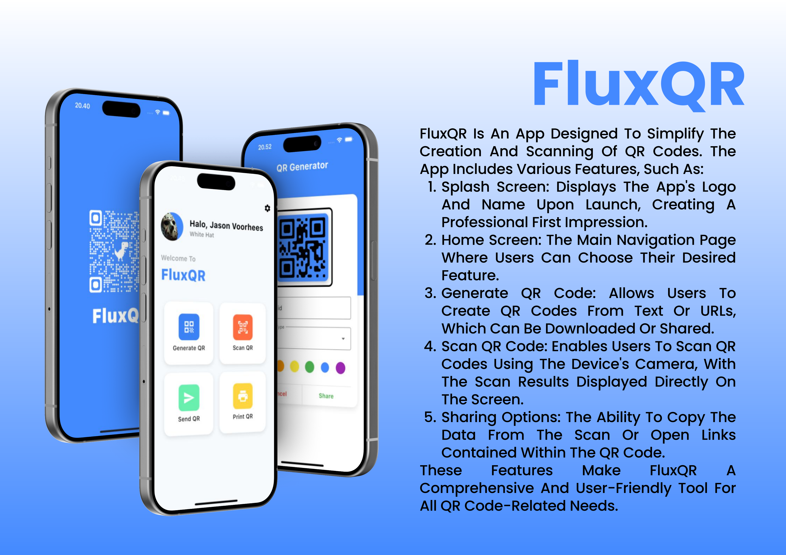

# 🌟 FluxQR: Your Ultimate QR Code Solution 🛡️

Welcome to *FluxQR* 🎉, my very first Flutter project! 🚀 Explore the exciting world of QR code generation and scanning with this app, where you can create and read QR codes effortlessly. From detailed product information to stunning visuals, *FluxQR* is designed to enhance your QR code experience. 🛡️✨

## 🛒 What's Inside?

**🛍️ QR Code Generation:** Create QR codes from text or URLs and download or share them with ease.  
**💬 Scan QR Code:** Use your device's camera to scan and read QR codes with real-time results.  
**📸 Visual Appeal:** Enjoy a sleek and modern design with high-resolution visuals showcasing your QR codes.

## 🎯 Why This App?

Because QR code management should be as fun and straightforward as possible! Whether you're a seasoned user or new to QR code technology, *FluxQR* offers an easy-to-use platform to generate and scan QR codes effortlessly. 🛡️💫

## 📸 Screenshots

Here's a sneak peek at what you can expect:

  

## 🖼️ Additional File

Below is an A4-sized landscape image related to *FluxQR*:

## 🚀 Features

- **🔍 Generate & Scan QR Codes:** Easily create and scan QR codes for a variety of uses.
- **⭐️ Real-Time Results:** View scan results directly on the screen for quick access.
- **🎁 Share & Save:** Download and share QR codes seamlessly with others.

## 🛠️ Built With

This app is built using **Flutter**, ensuring a seamless and enjoyable user experience on both iOS and Android platforms. 🖥️📱

## 🎨 Splash Screen

*FluxQR* features a custom splash screen to make a great first impression. The splash screen sets the tone for a delightful QR code experience right from the start! 🌟✨

---

Feel free to explore the app and let us know if you have any feedback or suggestions. Happy QR coding! 🛡️💖
